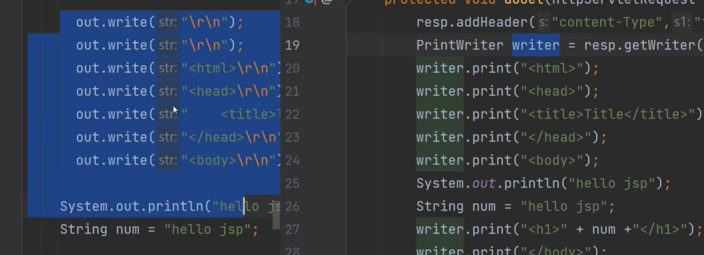

JSP是Java与HTML的糅合。可以在HTML中内嵌Java代码

eg：
``` 
<%@ page contentType="text/html;charset=UTF-8" language="java" %>
<html>
    <head>
        <title>Title</title>
    </head>
    <body>
        <%
            int num = 1;
        %>
        
        <h1><%=num %></h1>
    </body>
</html>

```

使用`<% %>` 嵌入Java代码，使用`<%= %>`嵌入标签内

1. 其实使用的JSP就是HttpServlet的子类
    这里的contentType`<%@ page contentType="text/html;charset=UTF-8" language="java" %>`

    就是HttpResponse.addHeader("content-Type","text/html;charset=UTF-8")

2. JSP只有在被访问后才会编译
    编译在Cache中tomcat/.../work/Catalina/localhost/项目名，
    会发现有个org.apache.项目名_jsp这么一个类， 
    这个类继承了HttpJspBase类，而这个HttpJspBase就是HttpServlet的子类

3. 看不到HttpJspBase源码？它运行在tomcat中，tomcat本身就有jsp-api.jar包。而在idea中没有它也没关系。只需要引入到lib即可

    这个_jsp类的service方法里就是在一直print。
    