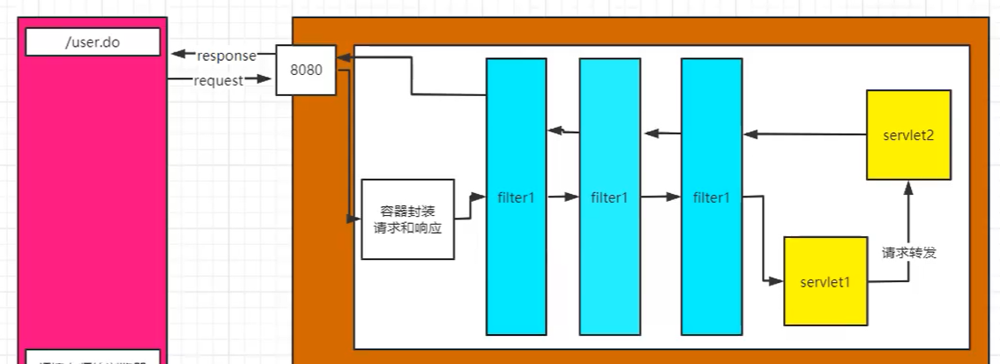

# filter

- 一定要实现javax.servlet包的Filter接口的三个方法init()、doFilter()、destroy()，空实现也行
- 启动服务器时加载过滤器的实例，并调用init()方法来初始化实例
- 每一次请求时都只调用方法doFilter()进行处理
- 停止服务器时调用destroy()方法，销毁实例



filter的init方法在容器启动时调用，在servlet销毁后销毁

- 责任链设计模式

- 在web.xml中设置filter，和Servlet神似 
```
 <filter>
     <filter-name></filter-name>
     <filter-class></filter-class>
 </filter>
 <filter-mapping>
     <filter-name></filter-name>
     <url-pattern></url-pattern>// 路径匹配
     <servlet-name></servlet-name>// 拦截指定servlet
     <dispatcher></dispatcher>
     // request include error forward 拦截请求类型，缺省为request
 </filter-mapping>
```
- 注解方式：name:"相当于servlet-name"

如果request set了相同的Attribute，前面的Filter会把Attribute的值覆盖。因为request自始至终是同一个

# 我写了一个Filter
流程：
1. 我写了一个login.jsp用于获取前端的输入，这个jsp向LoginServlet提交数据
2. LoginServlet的作用是校验输入值是否为admin（简单匹配一下）。如果否，转发到重新登陆，如果是，保存session，使转发的页面可以获取得到sessionScope
3. 有个问题，就是不管登没登陆，我都可以在地址栏里输入并访问我的页面。如何解决？
4. Filter的作用体现出来了，我想把只要访问/loginpage下的所有路径都重定向到login.jsp下。如何写？
5. 重写doFilter方法，如果满足条件，调用chain.doFilter。
    ```
        if(满足条件){
            chain.doFilter(req, resp);
        }else{
            做相应的处理，这里的需求是重定向到login.jsp
        }
    ```