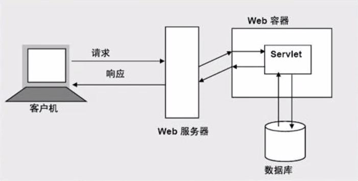
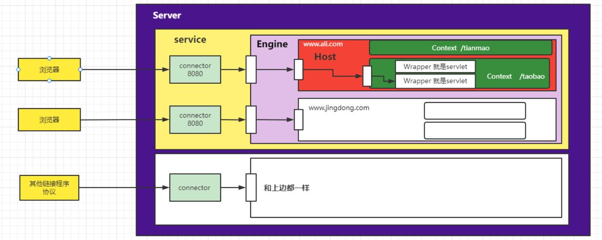

# 什么是Servlet
Servlet是Java类的服务端小程序。WEB-INF下是受保护的，只有服务器才能访问【url404】 
Servlet可以访问

# Servlet执行流程
    

- 客户端将HTTP请求发送给Web服务器（tomcat）
- 服务器再调用服务器容器（ServletContext）
- 容器再找到对应的Servlet执行

Web容器提供了运行Servlet所需的环境。负责初始化，实例化，调用服务方法。也就是管理Servlet的生命周期。连接Web服务器与Servlet的。

# Servlet生命周期

- 100 正在连接
- 200 连接成功 ok
- 403 权限不足
- 404 资源找不到
- 405 请求类型不一致
- 406 参数不全
- 500 服务器内部错误
