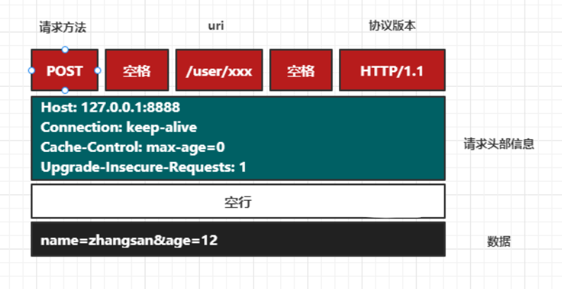
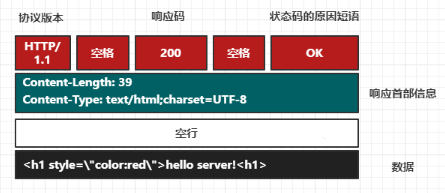

# request

1. 
2. 获取字符集编码 
    `req.getCharacterEncoding();set()`
3. 在req卓用于中存取对象
    `req,,setAttribute();getAttribute()`
4. HttpSession 会话
    `req.getSession()`
5. application
    `req.getServletContext()`
6. 获取Cookie
    `req.getCookies()`
7. 获取上下地址

# response

1. 设置字符集
    `resp.setCaractorEncoding("utf8");
     resp.getCaractorEncoding()`
2. 获取打印流
    `resp.getWriter()`
3. 设置响应的MIME类型
    `resp.setContentType("text/html;charset=utf8")`
4. 重定向
    - 客户端跳转`resp.sendRedirect(url)`
    - 转发是req.getRequestDispatcher
5. 添加Cookie
    `resp.addCookie(cookie)`
6. 添加头信息
    `resp.addHeader(name, value)`
7. 设置HTTP状态码
    `resp.status(200)`
