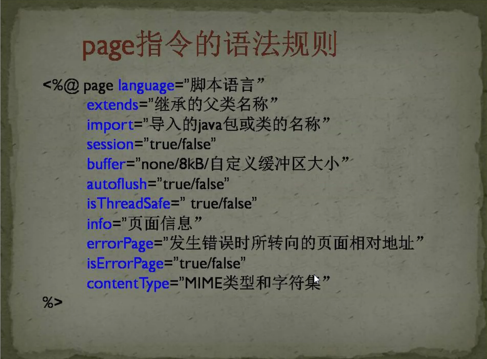

# 脚本指令动作
# 脚本
1. 定义变量 <%! %>
2. 表达式<%=%>
3. 注释<%--注释--%>
4. 指令<%@ >

# 指令
1. page 设置页面属性 
    
2. include 引入其他JSP页面
   - 见[007-重定向&转发.md](../../NOTES/Servlet/007-重定向&转发.md)
   - 和转发的区别：同：url没变；异：页面的控制权。JSP是新旧页面都有
   - 转发重定向包含：从url，跳转方式（C&S），页面内容，页面主权，快慢（服务器）
3. taglib

# 动作
1. 转发 <jsp:forward page="x.jsp">
2. 包含 <jsp:include page="x.jsp"> 动态包含
3. 创建Bean <jsp:useBean id="对象名" class="全限定类名" scope="域限定">
   <jsp:setProperty name="指定对象名" property="属性" value="值"/>